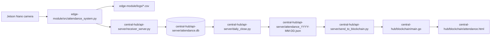

# Blockchain-Enabled Distributed Face Recognition Attendance System

This repository is a distributed attendance platform built around face recognition, period-based attendance logging, a central Raspberry Pi hub, and a blockchain-backed record store.

It is not a single-machine app. The code is split into two deployment targets:

- `edge-module/` runs on the Jetson Nano and handles camera capture, face registration, recognition, and local attendance logging.
- `central-hub/` runs on the Raspberry Pi 4 and handles ingestion, SQLite storage, daily export, and the Tendermint-based blockchain layer.

The project currently contains sample data, logs, and runtime artifacts for reference. Those files document the expected formats, but the live system should be deployed on the correct hardware modules instead of this laptop.

## What The System Does

1. Captures student faces on the Jetson Nano using the camera pipeline in `edge-module/src/config.py` and `edge-module/src/register_faces.py`.
2. Stores face encodings and registered names in `edge-module/data/encodings.npy` and `edge-module/data/names.npy`.
3. Runs live face recognition in `edge-module/src/attendance_system.py`.
4. Writes attendance logs locally in `edge-module/logs/`.
5. Sends period-by-period attendance data from the edge device to the Raspberry Pi hub through `edge-module/src/send_period_from_csv.py`.
6. Accepts and stores period records in SQLite through `central-hub/api-server/receiver_server.py`.
7. Exports the hub database to daily JSON snapshots with `central-hub/api-server/daily_close.py`.
8. Broadcasts attendance records to the Tendermint blockchain node with `central-hub/api-server/send_to_blockchain.py`.
9. Serves the blockchain-backed attendance dashboard from `central-hub/blockchain/main.go`.

## Repository Layout

```text
central-hub/
  api-server/
    create_db.py           SQLite schema bootstrap
    receiver_server.py     Flask receiver for period uploads from the edge module
    daily_close.py         Exports the SQLite table to JSON and clears the table
    send_to_blockchain.py  Sends exported attendance JSON to Tendermint RPC
  blockchain/
    main.go                Tendermint ABCI app and HTTP API for attendance records
    attendance.html        Blockchain attendance dashboard UI
    go.mod, go.sum         Go module definition and dependencies

edge-module/
  src/
    config.py              Camera, path, timetable, and processing configuration
    register_faces.py      Face capture and encoding tool
    attendance_system.py   Main recognition loop and per-period attendance logic
    server.py              Flask dashboard server for the edge-side web UI
    send_period_from_csv.py Sends a period's attendance CSV payload to the hub
    ascopy.py, rfcopy.py   Earlier/alternate versions of the edge attendance scripts
  web/
    index.html             Simple attendance dashboard page
    script.js               Polls the edge API for current attendance state
    style.css              Styling for the edge dashboard
  data/
    encodings.npy          Saved face encodings
    names.npy              Registered names matching the encodings
  logs/
    attendance.csv         Current attendance log format
    attendance_*.csv       Daily/period exports created by the recognition loop
  requirements.txt         Python dependencies for the edge module
```

## Architecture



## Edge Module: Jetson Nano

The edge module is the live recognition layer. It assumes Jetson-specific camera access through a GStreamer pipeline defined in `edge-module/src/config.py`.

Key files:

- `edge-module/src/register_faces.py`: captures face images, generates encodings, and updates `data/encodings.npy` and `data/names.npy`.
- `edge-module/src/attendance_system.py`: loads known faces, reads frames from the camera, marks students Present/Absent, writes logs, and sends completed period data to the hub.
- `edge-module/src/server.py`: serves the lightweight dashboard at the edge and exposes `/api/attendance/latest`.
- `edge-module/src/send_period_from_csv.py`: posts a JSON payload for a completed period to the Raspberry Pi receiver.

Important edge-side assumptions:

- The camera configuration is Jetson Nano specific and uses `nvarguscamerasrc`.
- The attendance window is controlled by `ATTENDANCE_WINDOW_MIN` and the period schedule in `PERIOD_TIMINGS`.
- `send_period_from_csv.py` currently posts to a hard-coded hub IP. That value must match the Raspberry Pi address in your deployment.

### Edge Dependencies

The Python requirements listed in `edge-module/requirements.txt` are:

- `opencv-python`
- `face_recognition`
- `numpy`
- `flask`

Depending on your Jetson image, `face_recognition` may also require native dependencies such as `dlib` and camera support packages.

### Typical Edge Workflow

1. Register each person with `edge-module/src/register_faces.py`.
2. Confirm the encodings and names were saved into `edge-module/data/`.
3. Start the recognition loop with `edge-module/src/attendance_system.py`.
4. Open the edge dashboard through `edge-module/src/server.py` if you want the local web view.

## Central Hub: Raspberry Pi 4

The hub is the storage and integrity layer. It receives period attendance payloads from the edge, stores them in SQLite, exports daily JSON snapshots, and publishes the final records to the blockchain node.

Key files:

- `central-hub/api-server/create_db.py`: creates the `attendance` table in SQLite.
- `central-hub/api-server/receiver_server.py`: accepts POST requests at `/upload_period_csv` and writes period columns into `attendance.db`.
- `central-hub/api-server/daily_close.py`: exports all rows to a dated JSON file, computes a daily hash, and clears the table for the next day.
- `central-hub/api-server/send_to_blockchain.py`: converts each JSON record into a Tendermint transaction and broadcasts it to the local RPC node.
- `central-hub/blockchain/main.go`: runs the Tendermint ABCI application, stores transactions in BadgerDB, and exposes `/attendance` for the dashboard.
- `central-hub/blockchain/attendance.html`: browser dashboard for viewing attendance and percentage summaries from the blockchain-backed API.

### Central Hub Data Model

The SQLite table created by `create_db.py` uses one row per student per date and stores period flags:

- `date`
- `stdid`
- `period1` through `period12`

### Central Hub Endpoints

- `POST /upload_period_csv` on port `5000`: receives period data from the edge module.
- `GET /attendance` on port `8080`: returns all blockchain-stored attendance records.
- Tendermint RPC on `127.0.0.1:26657`: receives transactions from `send_to_blockchain.py`.

### Typical Hub Workflow

1. Create the database with `central-hub/api-server/create_db.py`.
2. Start `central-hub/api-server/receiver_server.py`.
3. At the end of the day, run `central-hub/api-server/daily_close.py` to export and clear the SQLite table.
4. Send the exported JSON with `central-hub/api-server/send_to_blockchain.py`.
5. Run `central-hub/blockchain/main.go` to host the blockchain node and the `/attendance` API.

## Inputs And Outputs

This project has several distinct inputs and outputs, and the README now reflects them explicitly.

### Edge Inputs

- Live camera frames from the Jetson Nano camera pipeline.
- Registered face data from `edge-module/data/encodings.npy` and `edge-module/data/names.npy`.
- Timetable and processing settings from `edge-module/src/config.py`.

### Edge Outputs

- Live attendance log rows in `edge-module/logs/attendance.csv`.
- Per-day or per-period CSV exports in `edge-module/logs/attendance_YYYY-MM-DD.csv`.
- Period payloads posted to the Raspberry Pi receiver by `edge-module/src/send_period_from_csv.py`.
- Edge-side dashboard JSON from `GET /api/attendance/latest`.

### Hub Inputs

- Period payloads received at `POST /upload_period_csv`.
- Daily exported attendance JSON files from `daily_close.py`.
- Transaction records posted to the local Tendermint RPC endpoint.

### Hub Outputs

- SQLite rows in `central-hub/api-server/attendance.db`.
- Daily JSON snapshots such as `central-hub/api-server/attendance_YYYY-MM-DD.json`.
- Blockchain transactions stored by the ABCI application.
- Dashboard data served by `GET /attendance` for the web UI in `central-hub/blockchain/attendance.html`.

## Running The Project

This codebase is hardware-specific. Use the Jetson Nano for the edge module and the Raspberry Pi 4 for the hub. This laptop is only appropriate for editing, documentation, or code review unless you replace the hardware-specific camera and network settings.

## Example Runbook

The commands below match the way this project is typically run, but the paths, virtual environment names, host IPs, and ports may need to change for your own setup.

### Edge Module On Jetson Nano

Open one shell on the Jetson Nano and activate the edge environment first:

```bash
source ~/Desktop/hemanth/hemanth/bin/activate
cd ~/Desktop/hemanth/face-attendance/
python3 src/server.py
```

Open a second shell for live recognition:

```bash
cd ~/Desktop/hemanth/face-attendance/
python3 src/attendance_system.py
```

If you prefer to launch both processes together, keep in mind that the web server and recognition loop should stay in separate terminals for easier debugging.

### Central Hub On Raspberry Pi 4

Run the hub pieces in separate terminals so the receiver, blockchain node, and demo tools can stay independent:

```bash
cd ~/Desktop/database
python3 receiver_server.py
```

```bash
cd ~/attendance-chain/
./attendance-chain
```

```bash
cd ~/attendance-chain/
python3 -m http.server 9000
```

When you are ready to export the day and publish the records:

```bash
cd ~/Desktop/database
python3 daily_close.py
python3 send_to_blockchain.py attendance_2026-**-**.json
```

The blockchain dashboard in `central-hub/blockchain/attendance.html` currently points to a fixed attendance API host. If you move the hub or run the API on another machine, update that URL before using the page.

### Demo Time Sync

If you are replaying a test day, disable automatic time sync, set the system clock, then re-enable sync after the test:

```bash
sudo timedatectl set-ntp false
sudo timedatectl set-time "2026-05-19 13:45:00"
sudo timedatectl set-ntp true
```

Only use this on a test machine or during a controlled demo.

### Edge Module Setup

```bash
cd edge-module
python3 -m venv .venv
source .venv/bin/activate
pip install -r requirements.txt
```

Suggested execution order:

```bash
python src/register_faces.py
python src/attendance_system.py
python src/server.py
```

### Central Hub Setup

```bash
cd central-hub/api-server
python3 create_db.py
python3 receiver_server.py
```

For blockchain services:

```bash
cd central-hub/blockchain
go run . init
go run .
```

Then export and publish attendance data from the API layer:

```bash
cd central-hub/api-server
python3 daily_close.py
python3 send_to_blockchain.py attendance_YYYY-MM-DD.json
```

## Notes And Constraints

- The Jetson Nano camera pipeline in `config.py` will not run on a normal laptop camera without changes.
- Several scripts currently use hard-coded IP addresses for the Raspberry Pi hub. Replace them with the real deployment address before running across devices.
- The files under `data/`, `logs/`, and `central-hub/api-server/attendance.db` are runtime artifacts and example outputs, not the source of truth.
- `central-hub/blockchain/attendance.html` currently fetches attendance from a fixed host and should be edited if the API moves.

## Suggested Next Step

If you want, I can also add a smaller `README.md` inside `edge-module/` and `central-hub/` so each module has its own deployment guide.